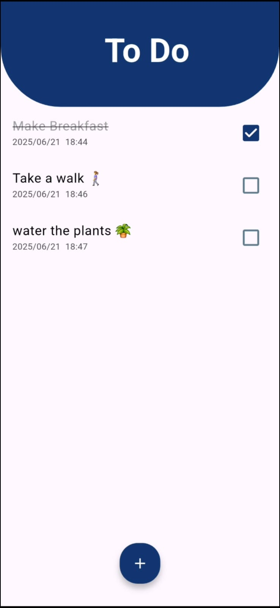

# ✔️ TODO App

A clean and minimal **Flutter To-Do app** built for practice and productivity.

Users can:

- ✅ Add tasks  
- 🗑️ Delete tasks  
- 🔄 Mark tasks as done or undone  
- 🕓 View the creation time of each task  

All data is stored **locally** using the lightweight NoSQL database **Hive** — no internet required.

---

## 🚀 Preview

---

## 🎥 Demo Video

Watch how the app works:  
[▶️ Watch Demo](Demo.mp4)

---

## 📱 APK Download

Try it on your Android device:  
[📦 Download APK](https://drive.google.com/file/d/1XrAiGFd7P3DtHNEXNc1zfEjD6P7Dcgff/view?usp=drive_link)
