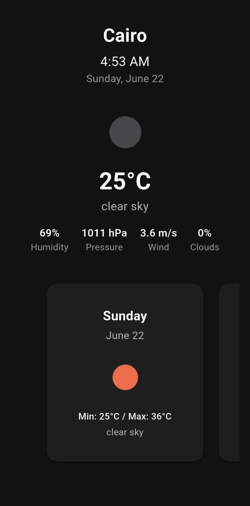

# 🍁 Windy – Weather App

A clean and minimal **Flutter weather app** built for practice and real-time forecasting.

Users can:

- 📍 Automatically detect their current city  
- 🌡️ View current temperature and weather conditions  
- 💧 See humidity, pressure, wind speed, and cloud coverage  
- 📅 Browse a 7-day forecast with daily summaries  

All data is fetched from the **OpenWeatherMap API**, using the device’s location via **Geolocator** and **Geocoding**.

---

## 🖼️ Preview

---

## 🎥 Demo Video

Watch the app in action:  
[▶️ Watch Demo](Demo.mp4)

`Note`: Samsung Weather was shown briefly to confirm the clear-sky forecast during that week.

---

## 📱 APK Download

Try it on your Android device:  
[📦 Download APK](https://drive.google.com/file/d/1znH91LSuNnZDxOD1o2Ec7f9XU9RJ1QPp/view?usp=sharing)
